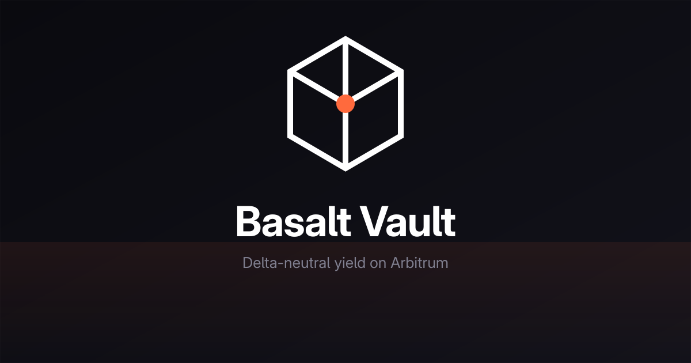

<p align="center">
  
  
  
  
</p>

---

## What It Is

> **Backtested over 2 years of on-chain data: 19.7% APY, -5.7% max drawdown, 2 rebalances.** See [docs/BACKTESTS.md](docs/BACKTESTS.md).


Basalt Vault earns yield from the GMX v2 GM BTC/USDC pool while fully hedging BTC price exposure. Deposit USDC, earn delta-neutral yield from your own isolated vault.

1. **Deposits GM tokens** as collateral on Dolomite Margin (lending protocol on Arbitrum)
2. **Borrows WBTC** against that collateral to offset BTC exposure inside GM
3. **Targets 100% hedge coverage** -- yield comes from GMX trading fees and funding, not directional risk
4. **Rebalances automatically** to maintain the hedge ratio as prices move

Contracts are **immutable** -- no proxy, no admin upgrades, no upgradeability patterns.

---

## How It Works

### Deposit

Two-stage async process:

1. **ZapIn** -- user sends USDC, ZapIn routes it to GMX (short or long side based on pool imbalance), GMX keeper fills the order (~2s), GM tokens arrive to user's wallet
2. **DepositHandler** -- user approves GM to handler, calls `deposit()` with exec fee, Dolomite keeper processes (~2s), then `finalizeDeposit()` completes the operation

### Withdraw

Two-stage async process:

1. **WithdrawHandler** -- user calls `withdraw(shares, minWbtcOut)` with exec fee, async GM unwrap via Dolomite, then `finalizeWithdraw()` returns WBTC to user
2. **ZapOut** -- user approves WBTC, calls `zapOut()` for instant USDC via Uniswap V3

### Rebalance

When the hedge ratio drifts from target, the keeper triggers a rebalance:

- **Over-hedged** (LTV above target) -- sell GM for WBTC, repay debt
- **Under-hedged** (LTV below target) -- borrow more WBTC, wrap to GM

### Emergency Mode

Irreversible last resort. Position is unwound in chunks with decaying slippage. Anyone can execute emergency operations -- no single point of failure.

---

## Architecture

```
                                ┌──────────────────┐
                                │  ManagerContract  │  (Ownable2Step, 6 roles)
                                └──────────────────┘
                                         |
                      ┌──────────── VaultCoreNftFactory ──────────┐
                      │  ERC721  (1 NFT = 1 VaultCore)            │
                      └───────────────────────────────────────────┘
                                         | clones
                          ┌──────────────┴───────────────┐
                          │                              │
                      VaultCore                      VaultState
                      (exec + ACL)                   (storage + config)
                          │
      ┌──────────┬────────┼────────────┬───────────────┐
      v          v        v            v               v
  Deposit    Withdraw  Manager    AsyncRecovery   FeeAccounting
  Handler    Handler   Handler      Handler          Handler
      \       |          |            |               /
       \      v          v            v              /
        \   Dolomite isolation account #100  <──────/
         \   (GM collateral <-> WBTC debt)
          \
           > GMX async wrap/unwrap (keeper-driven settlement)
```

### Key Design Decisions

| Aspect | Design |
|--------|--------|
| **Vault isolation** | 1 NFT = 1 VaultCore clone. Each user gets their own Dolomite isolation position. |
| **Handler pattern** | VaultCore is a dumb executor. All logic lives in stateless handlers, routed via `universalCall`. |
| **Handler upgrades** | Two-step: protocol manager proposes, NFT owner accepts. Either side can cancel. |
| **Pricing** | Single source: Dolomite (chained from Chainlink). No direct Chainlink price reads for NAV/LTV. |
| **Risk parameters** | Target LTV 50% (range 48-52%), hard cap 70%, Dolomite LT ~83.8%. |
| **Fees** | 20% HWM performance fee. No management fee by default. |
| **Fee distribution** | FeeSplitter (ERC20Votes, MasterChef-style accumulator). 80% vote threshold to rotate protocol manager (simple majority after 180-day timeout to prevent deadlock). |
| **Owner fallback** | ManagerContract owner can perform operational/configurator/proposer actions as emergency fallback. feeCollector stays independent. |
| **Async settlement** | All GMX wrap/unwrap operations are async (~2s). Recovery after deadline + 10 min grace. |

---

## Deployed Contracts (Arbitrum One) — Deployment 6

| Contract | Address |
|----------|---------|
| BasaltMath | [`0xbbfce8b98bd817fe2059a227c32ae086b4ed0c11`](https://arbiscan.io/address/0xbbfce8b98bd817fe2059a227c32ae086b4ed0c11) |
| DepositHandler | [`0xf41150e3800f81b2a7987cf7dc84852855d669d6`](https://arbiscan.io/address/0xf41150e3800f81b2a7987cf7dc84852855d669d6) |
| WithdrawHandler | [`0x73e9395d046fbe5b8ae6bcdb4c5304bb974d1520`](https://arbiscan.io/address/0x73e9395d046fbe5b8ae6bcdb4c5304bb974d1520) |
| ManagerHandler | [`0xbc5150333eede35f511f0fca17b02a99fe29fec3`](https://arbiscan.io/address/0xbc5150333eede35f511f0fca17b02a99fe29fec3) |
| AsyncRecoveryHandler | [`0xa430d5d60d1bcb29e7e8a0a8663e644bb377fe72`](https://arbiscan.io/address/0xa430d5d60d1bcb29e7e8a0a8663e644bb377fe72) |
| FeeAccountingHandler | [`0x32ccb39393427801483226531be02eaf4284d6ce`](https://arbiscan.io/address/0x32ccb39393427801483226531be02eaf4284d6ce) |
| VaultCore (impl) | [`0x8cc187846e3bee690cbb37c431701c4c587550f1`](https://arbiscan.io/address/0x8cc187846e3bee690cbb37c431701c4c587550f1) |
| VaultState (impl) | [`0x9be65dfdb5a108151af95524072420d5c2075ddf`](https://arbiscan.io/address/0x9be65dfdb5a108151af95524072420d5c2075ddf) |
| InitialCoreAddressBook | [`0xcd2f28939e4b9f4d2af772137396ec42ad6d8143`](https://arbiscan.io/address/0xcd2f28939e4b9f4d2af772137396ec42ad6d8143) |
| FeeSplitter | [`0x807bc93a1a3336572b4d43065baae5bb87c5bc20`](https://arbiscan.io/address/0x807bc93a1a3336572b4d43065baae5bb87c5bc20) |
| ManagerContract | [`0x638505776382d471091f9bb8301118023d6dabb3`](https://arbiscan.io/address/0x638505776382d471091f9bb8301118023d6dabb3) |
| VaultCoreNftFactory | [`0x08e466fb09617d16ed27da9ea43ba601665f3b89`](https://arbiscan.io/address/0x08e466fb09617d16ed27da9ea43ba601665f3b89) |
| BasaltZapIn | [`0x1236384c4614c0ccc463e1ead98cb896ca2c9e87`](https://arbiscan.io/address/0x1236384c4614c0ccc463e1ead98cb896ca2c9e87) |
| BasaltZapOut | [`0x69a445d1950b053fe70a2c48a5925ab0848dd47a`](https://arbiscan.io/address/0x69a445d1950b053fe70a2c48a5925ab0848dd47a) |
| BasaltGmUnwrapper | [`0x6c5dd45766b996aeeeb5d311d79e8d0e4c44ed98`](https://arbiscan.io/address/0x6c5dd45766b996aeeeb5d311d79e8d0e4c44ed98) |


---

## Security

### Immutability

All deployed contracts are immutable. There are no proxies, no admin upgrade paths, and no upgradeability patterns. Handler rotation is the only mutable surface: protocol manager proposes a new handler, and the vault NFT owner must explicitly accept it.

### Risk Parameters

| Parameter | Value |
|-----------|-------|
| Target LTV | 50% (configurable 48-52%) |
| Hard cap LTV | 70% |
| Dolomite liquidation threshold | ~83.8% |
| Safety buffer to liquidation | ~13.8% |
| Performance fee | 20% HWM |
| Async recovery grace | 10 min after keeper deadline |
| Cooldown | 1 block after deposit finalize |
| FeeSplitter governance threshold | 80% weighted vote (simple majority + 10% quorum after 180 days) |

### Key Invariants

- All state changes follow the Checks-Effects-Interactions pattern
- `universalCall` is the only entry point for handler-driven state mutation, gated by `onlyHandler` + initiator ACL
- Post-deposit and post-rebalance LTV is always verified against the 70% hard cap
- Oracle sequencer uptime is checked before deposits and rebalances
- Async recovery cannot cancel Dolomite liquidation operations
- Fee uses profit-based HWM: `profit = max(NAV + totalWithdrawn - totalDeposited, 0)`, fee only on new profit peaks

---

## Development

Built with [Foundry](https://getfoundry.sh/). Solidity 0.8.28.

```bash
# Build
forge build

# Test (requires Arbitrum fork, uses Anvil cache)
./scripts/run-tests.sh
```

### Verification

```bash
# Formal verification (Halmos)
./scripts/run-halmos.sh

# Mutation testing
./scripts/run-mutation.sh
```

### Project Structure

```
src/
  core/           VaultCore, VaultState, VaultCoreNftFactory,
                  ManagerContract, FeeSplitter, InitialCoreAddressBook
  handlers/       DepositHandler, WithdrawHandler, ManagerHandler,
                  AsyncRecoveryHandler, FeeAccountingHandler
  libraries/      BasaltConstants, BasaltAddresses, DolomiteReader,
                  OracleGuard, GMCalculator, BasaltPrecision, ZapInMath
  pure/           BasaltMath (stateless math)
  ux/             BasaltZapIn, BasaltZapOut, BasaltGmUnwrapper
  interfaces/     All interface definitions
```

---

## Roadmap

This is the first vault in the Basalt protocol family. Next steps:

- Additional GM market vaults (ETH/USDC, SOL/USDC)
- Meta-vaults aggregating across individual market vaults
- Cross-chain deployment
